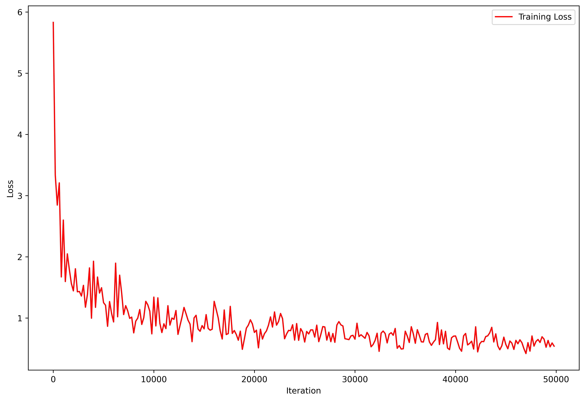
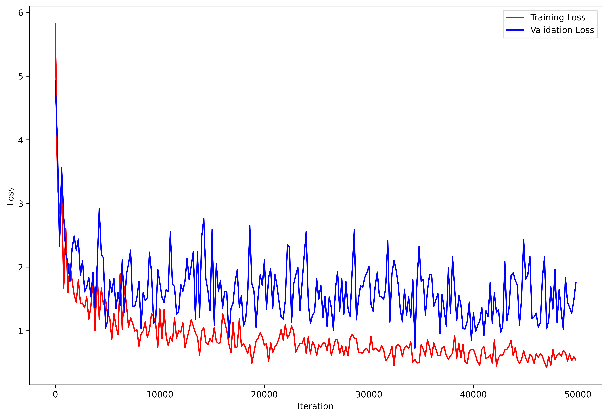

# AudioSeperator

## Introduction
This is a singing voice seperation tool developed using recurrent neural network (RNN).The mp3 file stored in songs directory is split into 2: the singer voice and background music and stored as wav files in ``main-demo``.

 ## Dataset
 The MIR-1K dataset,which is available on Kaggle, was used to train the network. 4 RNN layers,along with some hyperparameter tunings, were used to train the model on 40,000 iterations of the dataset, which took 2 hours.
 
 To train the model, download the dataset and place it in a folder named MIR-1K and then in the terminal:
```bash
$ python train.py
```
<p align="center">
    
</p>

<p align="center">
    
</p>

## Example
The pretrained model was then used on 'Bye Bye Bye' song, which is placed in the ``songs`` directory.The separated sources, together with the monaural source, were saved to the ``main-demo`` directory.
The seperated sources are not perfect as the dataset is not large enough and the model should be experimented with more layers.

## To-Do List
Evaluate against other models such as U-Net
Train on bigger dataset and more layers
Create front-end interface 
